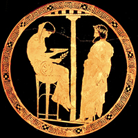

#Delphi

Delphi is where Apollo slained the dragon **Python** and founded his own temple. Those who are wondering about their life are welcomed to Delphi to discover his past and future. You can find out the future of your **Python** code as well using Delphi.

---

##Rationale

There are two ways to write python code. By using the `batch mode` and the `interactive mode`. 

`Batch mode`, or whatever you might call it, is the most common way to execute a python scrpipt just by running `python file.py`. However, it can frustrating to have a **change-close-execute-open-change-close-execute** cycle.

`Interactive mode` is responsive, it shows you the result right away. But it quickly becomes unmanageable as soon as you have more than one function or a few variables.

**Delphi** gives you a third option to write your python code. The idea is similar to Apple's [Playground](https://developer.apple.com/swift/blog/?id=24). Though not as fancy, I believe it is incredibly useful.

---

##Demo

Nothing illustrates better than a video:
S

___

##Contribute

If you have any thoughts about this project, please let me know! If you like **Delphi** let's work on making it more robust and powerful.